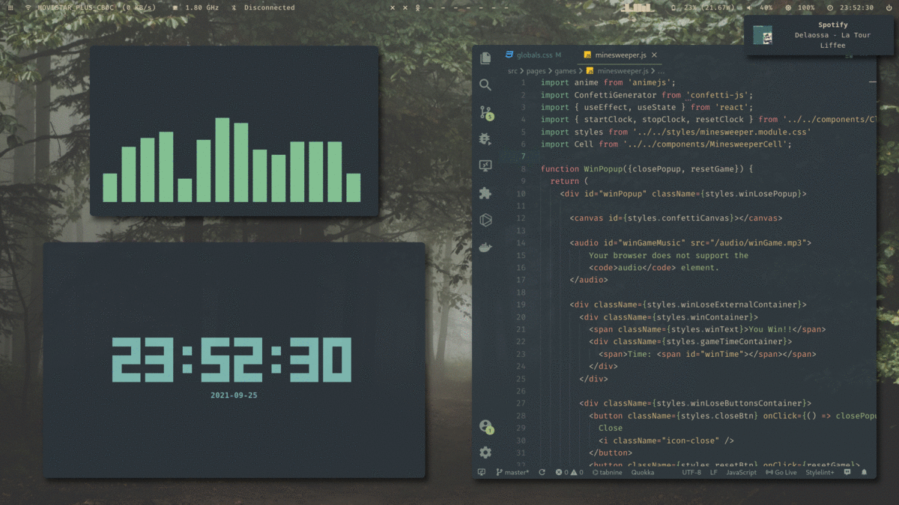
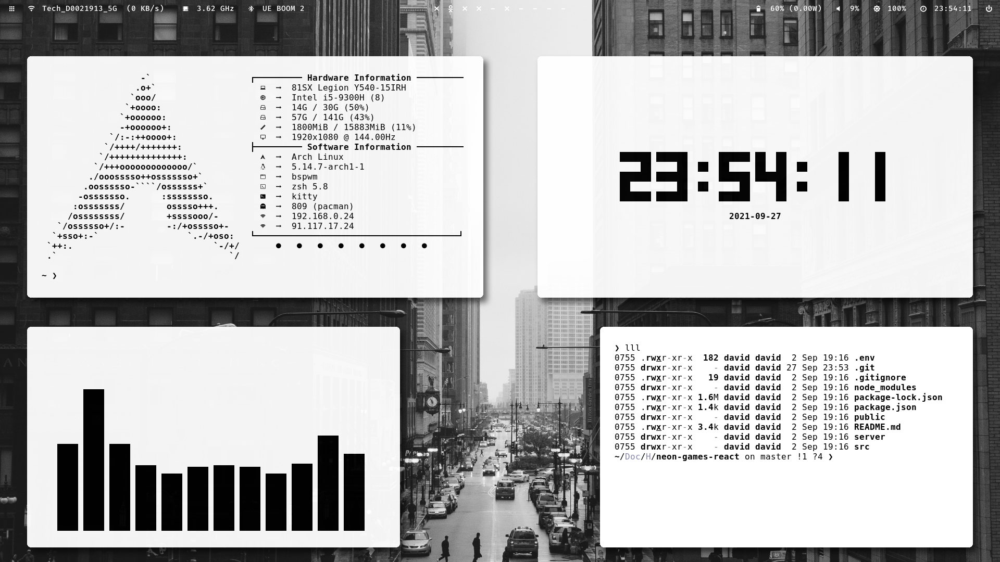
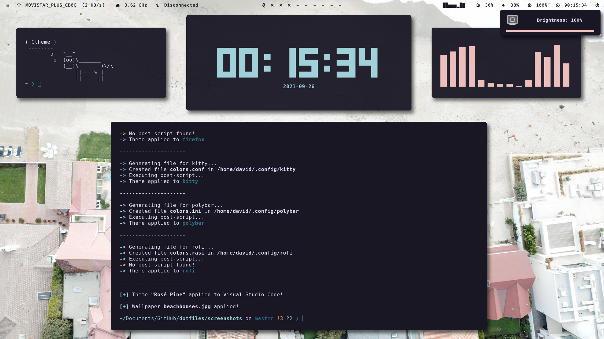

# Dotfiles 

My current Arch Linux dotfiles, here to show you how beautiful your desktop can be 🙆🏻‍♂️

All of this can't be done without [Gtheme 🎨](https://github.com/daavidrgz/gtheme/)




## Some notes

To install installed programs just run:
```console
yay -S $(cat .intalled_programs)
```

To get the rofi calculator to work refer to the original repo [rofi-calc](https://github.com/svenstaro/rofi-calc)


## Detailed screenshots 

* BlackAndWhite-Light



* Iceberg-Dark


* Everforest-Dark-Hard


* Rosé-Pine



* Snazzy


* Gruvbox-Dark


