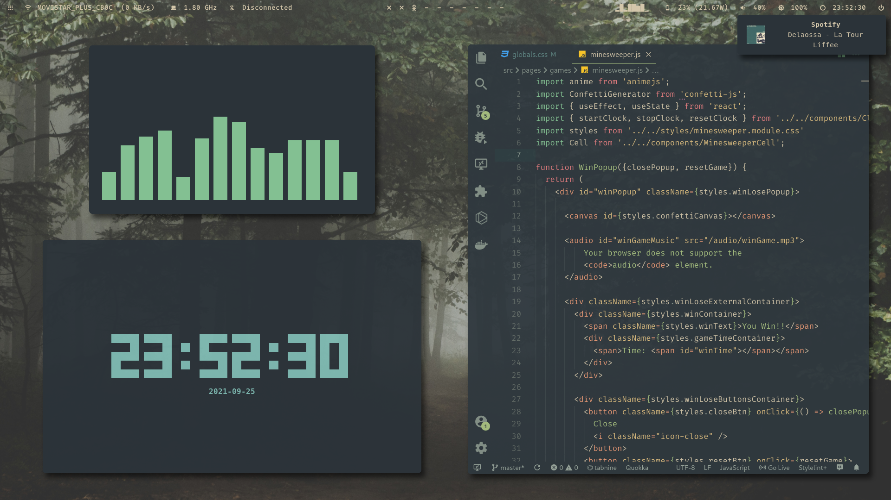
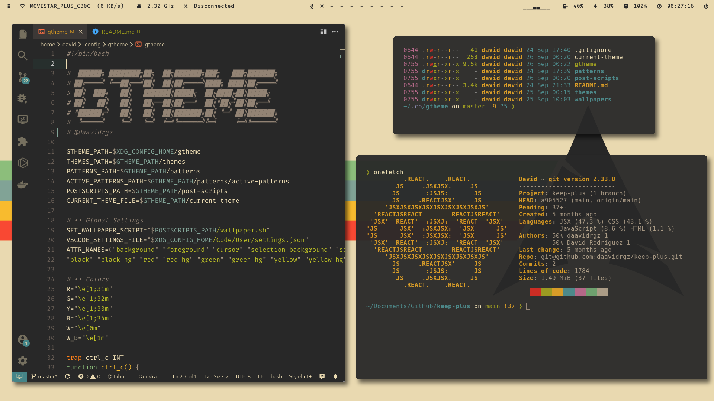

# Dotfiles 

My current Arch Linux dotfiles, here to show you how beautiful your desktop can be 🙆🏻‍♂️

All of this can't be done without [Gtheme 🎨](https://github.com/daavidrgz/gtheme/)

## Detailed screenshots 

* Black-On-White

* Iceberg-Dark

* Everforest-Dark-Hard

* Rosé-Pine

* Snazzy

* Gruvbox-Dark

