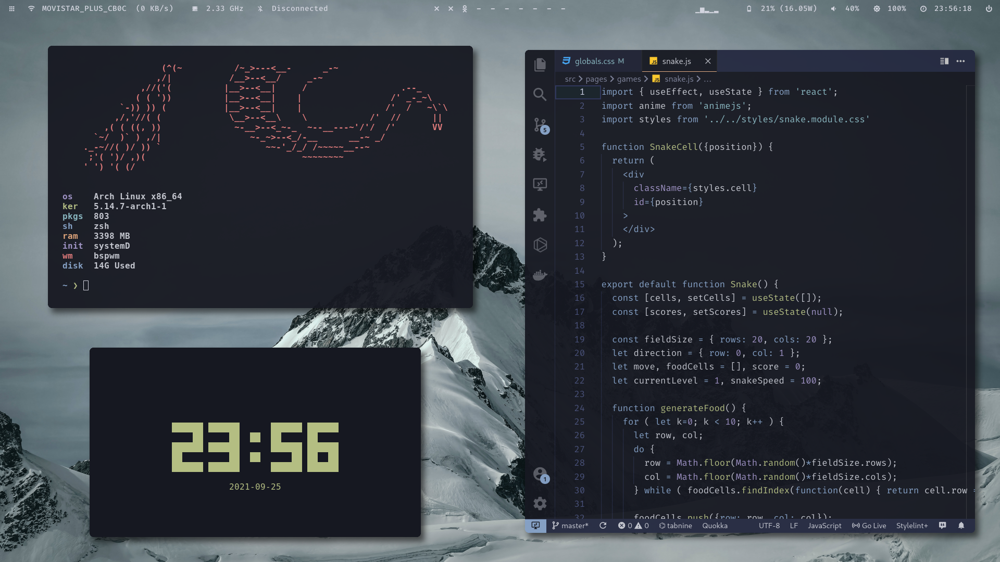
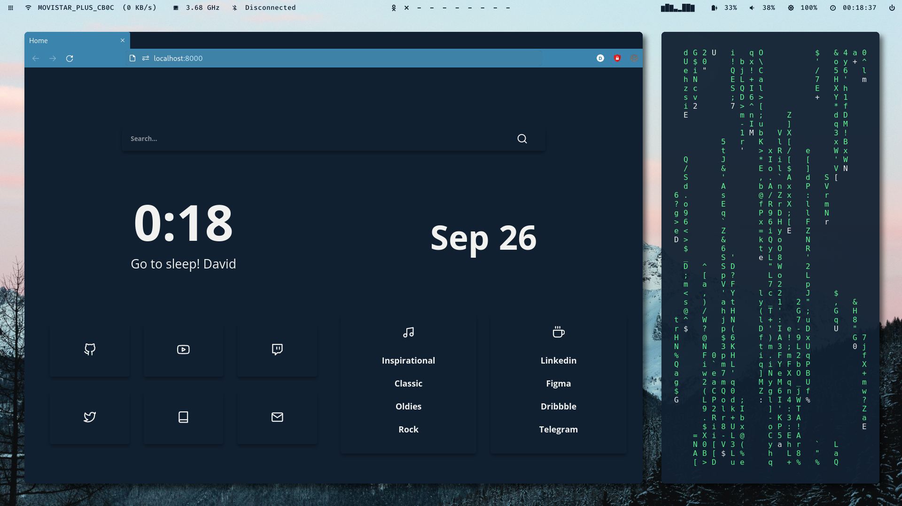

# Dotfiles 

My current Arch Linux dotfiles, here to show you how beautiful your desktop can be.  
All of this can't be done without [Gtheme](https://github.com/daavidrgz/gtheme/).

* Iceberg-Dark

* Everforest-Dark-Hard

* Rosé-Pine

* Snazzy

* Gruvbox-Dark

